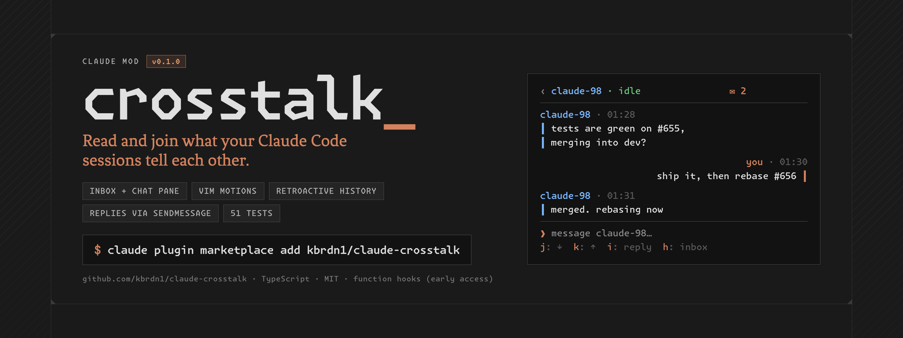

<p align="center">
  <picture>
    <source media="(prefers-color-scheme: dark)"  srcset="docs/_assets/banner.png">
    <source media="(prefers-color-scheme: light)" srcset="docs/_assets/banner-light.png">
    
  </picture>
</p>

# crosstalk

A [Claude Mod](https://github.com/anthropics/claude-code/tree/main/mods) that
turns Claude Code's cross-session messaging into a conversation you can read
and join: `/crosstalk` opens a pane with this session's exchanges with your
other Claude Code sessions, and a field to answer them yourself.

```
│ crosstalk                               ● claude-crosstalk-33  ✕
│ ─────────────────────────────────────────────────────────────
│ ○ claude-98                                             02:04
│   you: via le socket
│
│ ● claude-flow
│   no message yet
│
│ ● crimson-desert-start
│   no message yet
│ ─────────────────────────────────────────────────────────────
│ j: ↓  k: ↑  l: open  g: top  q: close
```

```
│ ‹ claude-98                                                   ✕
│ ─────────────────────────────────────────────────────────────
│ ──────────────────────── sat 19 sep ─────────────────────────
│ claude-98 · 01:28
│ ┃ Démo crosstalk depuis claude-98 : réponds-moi
│ ┃ une phrase courte via SendMessage à claude-98
│ ┃ (rien d'autre, pas d'outil en plus).
│
│                                                   you · 02:01
│                                           réponse persistée ┃
│
│                                               via le socket ┃
│ ─────────────────────────────────────────────────────────────
│ ❯ message claude-98…
│ ⏎ send · esc normal mode
```

> ⚠️ **Early access.** Mods run on Claude Code's function hooks, which are
> behind `CLAUDE_CODE_ENABLE_FUNCTION_HOOKS=1` and may change between releases
> without notice. crosstalk is written against the declarations in
> [`types/claude-code.d.ts`](types/claude-code.d.ts) (their first line names
> the Claude Code build).

## What it does

Claude Code already moves the messages: `SendMessage` and `ListAgents` let
sessions on one machine talk. crosstalk adds the part you see:

- **Incoming**: every peer delivery (`session.receive`, origins `peer` and
  `peer-send-message`) is recorded under the sender's name, unchanged.
- **Outgoing**: every `SendMessage` this session makes (`tool.call`) is
  recorded under its recipient, unchanged.
- **The pane** (`/crosstalk`, again to close) opens on an **inbox**: one row
  a conversation (and each idle local session), most recent first, with its
  status, its name whole, its unread count, its time and its last message.
  ⏎ opens the **conversation**: the thread anchored on its newest message,
  grouped by side and day with Markdown bodies, and a reply field that sends
  through `SendMessage`; `✉ N` in its header counts what arrived elsewhere.
  It lays out for its width: your messages on the right from 56 columns,
  both sides stacked left below, a line never past 72 columns.
- **Unread**: while the pane is closed, the status line counts the messages
  nobody looked at.

Keys, vim-style, drawn at the bottom of the pane as they apply:

| | Inbox | Conversation, normal mode | Conversation, insert mode |
|---|---|---|---|
| `j` / `k` | next / previous row | scroll a message down / up | typed |
| `d` / `u` | — | half a page down / up | typed |
| `g` | top row | back to the latest | typed |
| `l`, `⏎` | open the conversation | — | `⏎` sends |
| `i` | — | reply (insert mode) | typed |
| `h` | — | back to the inbox | typed |
| `esc` | close the pane | back to the inbox | normal mode |
| `q` | close the pane | close the pane | typed |

A conversation opens in insert mode. Arrows, `⏎`, the wheel and
`PageUp`/`PageDown` work as well, and `ctrl+x tab` goes back and forth with
the prompt. Hotkeys are one lowercase letter or digit: shift is ignored (no
`G` apart from `g`), and there is no `ctrl` or count. Each conversation
keeps its own draft. The pane docks beside the transcript in the fullscreen
layout from 110 columns (`ctrl+x ←/→` resizes it), inline above the prompt
otherwise.

A message held for approval (the two sessions run in different permission
modes) already shows in the pane: crosstalk sees deliveries as they arrive,
before the engine queues them.

### History

- **Kept**: every exchange is saved in the plugin's store under the session's
  id, so a reload, a restart or a `--resume` finds the conversation as it
  was, replies typed in the pane included. The 50 most recent sessions are
  kept.
- **Retroactive**: on a session's first start with crosstalk, the history is
  rebuilt from the session's journal (`~/.claude/projects/…/<id>.jsonl`):
  the messages peers sent it and the model's `SendMessage` calls, with their
  times, including those from before the mod was installed. The plugin API
  does not expose incoming peer messages (`$.session.messages()` hides them),
  so this reads Claude Code's own journal format, which is undocumented: a
  change there empties the rebuilt history and breaks nothing else. Replies
  typed in a pane before crosstalk kept them are in no journal.
- **Renames**: a session renamed keeps its conversation once it writes again
  from the same socket, and a reply to a peer `ListAgents` no longer lists by
  that name goes to the socket it last wrote from.

Not there yet: threads with subagents or teammates, remote (Remote Control /
cloud) peers beyond what `ListAgents` reports.

## Install

```bash
git clone https://github.com/kbrdn1/claude-crosstalk && cd claude-crosstalk
make install                              # from this checkout
make install SOURCE=kbrdn1/claude-crosstalk   # or from GitHub
```

`make install` adds the repo as a plugin marketplace, installs `crosstalk`,
and merges `CLAUDE_CODE_ENABLE_FUNCTION_HOOKS=1` into the `env` of
`~/.claude/settings.json` (nothing else in that file changes). Then, in any
new session: `/crosstalk`.

- From a checkout, the plugin **loads in place**: an edit takes effect at the
  next session start or `/reload-plugins`, no reinstall.
- From GitHub, it is a versioned copy: `make update` pulls a newer release.
- The flag turns function hooks on for **every** session, so Claude Code's
  built-in mods load too (`diff`, `agents-md`, `telemetry`, and
  `sec-default` under managed settings). `agents-md`'s default reads a
  project's `AGENTS.md` where it has no `CLAUDE.md`.

```bash
make update      # pull the latest into the installed copy (GitHub source)
make uninstall   # remove the plugin and its marketplace (the flag stays)
```

Without installing anything: `make dev` starts Claude Code with this checkout
loaded as a mod.

## Develop

Requires Claude Code (a build that carries function hooks), `bun` (for
`tsc`, oxlint and oxfmt) and `jq`.

```bash
make test       # claude plugin test .
make typecheck  # tsc against types/
make lint       # oxlint
make fmt        # oxfmt, in place (make fmt-check to only check)
make validate   # claude plugin validate
make ci         # fmt-check, lint, typecheck, validate, test
make types      # regenerate types/ after a Claude Code update
```

See [CONTRIBUTING.md](CONTRIBUTING.md) and [CLAUDE.md](CLAUDE.md).

## License

[MIT](LICENSE.md) © Kylian Bardini
